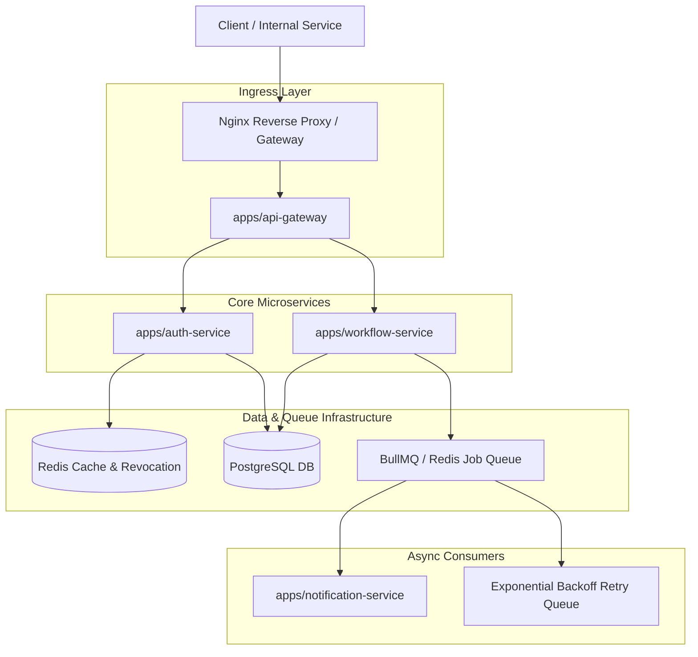

# ForgeGate – Distributed Backend Workflow Platform

ForgeGate is a production-style, microservices-based distributed backend workflow execution platform. Built as a high-performance pnpm monorepo, it demonstrates system architecture patterns including API Gateway routing, distributed background job processing, state-machine workflow execution, structured JSON logging, Redis-backed caching, and containerized deployment.

Instead of a generic CRUD project, ForgeGate focuses on core backend engineering challenges: distributed job queue reliability, failure recovery, atomic workflow step execution, and microservice boundary isolation.

---

## Folder Structure

```text
ForgeGate/
├── apps/
│   ├── api-gateway/          # Central ingress entry point, validation & swagger
│   ├── auth-service/         # User authentication, JWT token rotation, RBAC
│   ├── workflow-service/     # Workflow state engine & distributed job queue
│   └── notification-service/ # Asynchronous email & event consumer worker
├── packages/
│   ├── common/               # Shared DTOs, response interceptors, exception filters
│   ├── logger/               # Structured JSON Winston logging module
│   ├── auth/                 # Shared JWT strategies & RBAC decorators
│   └── config/               # Validated environment configuration schemas
├── infra/
│   ├── docker/               # Dockerfiles & docker-compose orchestration
│   ├── nginx/                # Reverse proxy gateway routing
│   ├── postgres/             # Database initialization
│   └── redis/                # Caching & BullMQ queue storage
├── docs/
│   ├── architecture/         # System design documentation
│   └── api/                  # OpenAPI specifications
└── prisma/                   # Centralized database schema & migrations
```

---

## High-Level Architecture



---

## Key Backend Features

- **Microservice Architecture & Monorepo**:
  - Managed via pnpm workspaces with clear service boundary separation.
  - Shared internal npm packages (`@forgegate/common`, `@forgegate/logger`, `@forgegate/auth`, `@forgegate/config`).
- **Distributed Workflow Execution Engine**:
  - Asynchronous step execution engine with state transitions (`pending`, `running`, `completed`, `failed`).
  - Distributed background queues powered by BullMQ / Redis.
  - Automatic job retry queues with exponential backoff and dead-letter handling.
- **Production Observability & Logging**:
  - Structured JSON logging using Winston across all microservices.
  - Multi-service health check endpoints monitoring PostgreSQL, Redis, and message brokers.
  - Prometheus metrics collection (`/api/v1/metrics`).
- **Security & Authorization**:
  - JWT authentication with access/refresh token rotation.
  - Immediate Redis token revocation / blacklist.
  - Role-Based Access Control (RBAC) with custom route decorators.
- **Infrastructure & Containerization**:
  - Nginx API Gateway reverse proxy routing requests to downstream microservices.
  - Fully containerized environment via Docker Compose.

---

## Tech Stack

| Layer | Technology |
| :--- | :--- |
| **Language & Runtime** | TypeScript, Node.js v20+ |
| **Monorepo Manager** | pnpm Workspaces |
| **Backend Framework** | NestJS |
| **Database & ORM** | PostgreSQL 16, Prisma ORM |
| **Cache & Distributed Queue** | Redis 7, BullMQ, ioredis |
| **Message Broker** | RabbitMQ 3 |
| **Reverse Proxy** | Nginx |
| **Logging & Metrics** | Winston (JSON), Prometheus |
| **Containerization** | Docker, Docker Compose |

---

## How to Run

### Prerequisites
- Node.js v20 or higher
- pnpm (v8 or higher)
- Docker & Docker Compose

### Local Monorepo Setup

1. **Clone the Repository**:
   ```bash
   git clone https://github.com/NabarupDev/ForgeGate.git
   cd ForgeGate
   ```

2. **Install Monorepo Workspace Dependencies**:
   ```bash
   pnpm install
   pnpm approve-builds --all
   ```

3. **Configure Environment Variables**:
   ```bash
   cp .env.example .env
   ```

4. **Start Infrastructure Containers (PostgreSQL, Redis, RabbitMQ, Prometheus)**:
   ```bash
   pnpm run docker:up
   ```

5. **Generate Database Client & Run Migrations**:
   ```bash
   pnpm run prisma:generate
   pnpm run prisma:migrate
   ```

6. **Build All Workspace Packages & Microservices**:
   ```bash
   pnpm run build
   ```

---

## Docker Deployment

To launch the entire platform (Nginx Gateway, API Gateway, Microservices, Databases, and Queue workers) with a single command:

```bash
docker-compose -f infra/docker/docker-compose.yml up --build -d
```

### Active Endpoints

- **Nginx Ingress / API Gateway**: `http://localhost/api/v1`
- **Swagger OpenAPI Documentation**: `http://localhost/api/v1/docs`
- **Gateway Health Endpoint**: `http://localhost/api/v1/health`
- **Prometheus Metrics**: `http://localhost:9090`
- **RabbitMQ Management Console**: `http://localhost:15672` (guest / guest)

---

## API Documentation

Swagger OpenAPI 3.0 specs are aggregated at the API Gateway level.

- Interactive API Spec: [http://localhost/api/v1/docs](http://localhost/api/v1/docs)
- Static OpenAPI File: [docs/api/openapi-spec.json](docs/api/openapi-spec.json)

---

## Screenshots

*(Place system monitoring dashboards, Swagger UI, and Redis execution log screenshots here)*

---

## Resume Impact Highlights

When presenting ForgeGate on a backend engineering resume:

```text
ForgeGate – Distributed Backend Workflow Platform
- Designed a microservices architecture with an API Gateway, authentication service, and asynchronous job processing using BullMQ and Redis.
- Built secure JWT authentication with RBAC, request validation, Redis-backed token revocation, and centralized JSON logging.
- Containerized microservices using Docker Compose and documented endpoints using Swagger OpenAPI specs.
```

---

## Future Improvements

- Implement multi-tenant workflow isolation for secure workspace execution.
- Add OpenTelemetry distributed tracing across HTTP microservice boundaries.
- Build visual workflow builder web UI.
