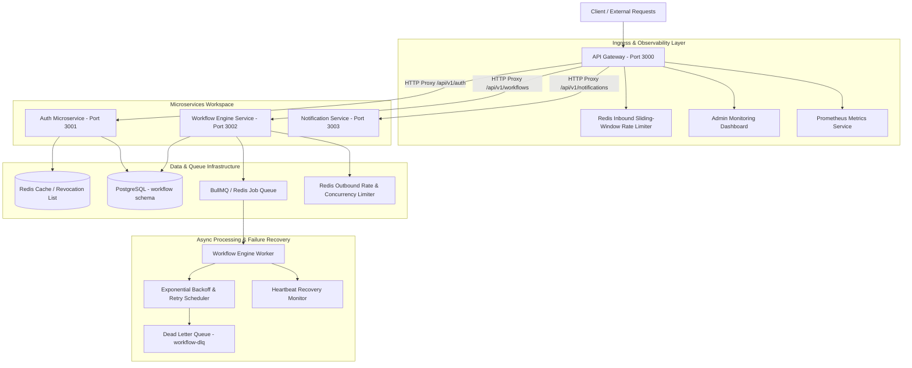

# ForgeGate - Distributed Microservices & Workflow Execution Engine

ForgeGate is an open-source distributed microservices workflow execution engine and API Gateway built as a high-performance pnpm monorepo in TypeScript. Built with NestJS, PostgreSQL (multi-schema), Redis, and BullMQ, it delivers multi-tenant data isolation, ingress reverse proxying, state-machine step execution, intelligent backoff retries, Dead Letter Queue (DLQ) job management with manual replay, structured Winston logging, and Prometheus observability.

---

## Execution Guarantee & System Trade-offs

> [!IMPORTANT]
> **Execution Guarantee**: ForgeGate guarantees **at-least-once execution** for workflow steps, combined with configurable idempotency key propagation (`Idempotency-Key` header) for downstream HTTP providers that support deduplication.
>
> **Exactly-Once Notice**: ForgeGate does **not** claim exactly-once side-effects against arbitrary third-party HTTP endpoints due to fundamental distributed network boundaries (e.g. network partition after downstream provider execution but prior to worker acknowledgment).

---

## System Architecture



---

## Workspace Directory Structure

```text
ForgeGate/
├── apps/
│   ├── api-gateway/          # Central entry point, HTTP proxying, rate-limiting & metrics exporter
│   ├── auth-service/         # Authentication, multi-tenant RBAC, JWT issuance & token revocation
│   ├── workflow-service/     # Workflow state-machine engine, BullMQ retry queues & DLQ worker
│   └── notification-service/ # Asynchronous notification worker & event consumer
├── packages/
│   ├── auth/                 # Shared JWT strategies, Fine-grained AuthorizationPolicy & tenant context
│   ├── common/               # Low-cardinality MetricsService, DTOs & exception filters
│   ├── config/               # Joi validated environment schemas
│   └── logger/               # Winston structured JSON logging with correlationId context
├── docs/
│   ├── architecture/
│   │   └── system-design.md  # Detailed architecture, sequence diagrams & state machines
│   ├── adr-001-service-data-ownership.md # Multi-schema database architecture ADR
│   └── IDEMPOTENCY.md        # Downstream idempotency model & header configuration
├── infra/
│   ├── docker/               # Docker Compose container orchestration
│   ├── nginx/                # Reverse proxy configuration
│   └── prometheus/           # Prometheus scraping configuration
└── prisma/                   # Multi-schema PostgreSQL database schema & migrations
```

---

## Key Technical Capabilities

### 1. Ingress API Gateway & Active Routing
- Reverse HTTP proxy forwarding client requests to downstream microservices while propagating correlation IDs (`x-correlation-id`) and multi-tenant headers (`x-tenant-id`).
- Redis-backed sliding-window rate limiter enforcing request throttling (100 req/min default per IP/Tenant).

### 2. Multi-Tenant Architecture & Data Isolation
- Logical multi-tenant separation (`Tenant` schema entity in `auth` schema).
- JWT claims context propagation ensuring `tenantId` is transmitted to downstream services and background workers.
- Fine-grained server-side authorization checks (`AuthorizationPolicy`) preventing cross-tenant data access.

### 3. State-Machine Workflow Engine
- Deterministic workflow lifecycle states: `pending` -> `running` -> `retrying` -> `completed` / `failed`.
- Step execution status transitions: `PENDING` -> `RUNNING` -> `SUCCEEDED` / `FAILED` / `TIMED_OUT`.
- Atomic step claiming (`updateMany` with status `PENDING`) ensuring duplicate worker execution prevention.

### 4. Resilient Retries & Rate-Limit Deferrals
- Automatic classification of HTTP failures (`PERMANENT_FAILURE`, `RATE_LIMITED`, `TRANSIENT_FAILURE`, `TIMEOUT`, `NETWORK_FAILURE`).
- Respects downstream `Retry-After` headers (supporting delay-seconds and HTTP dates).
- Rate-limit deferrals (`429` / `503` / `529`) do **not** consume the normal retry attempt budget.
- Enforces strict upper bounds on max normal retries (default 3) and max rate-limit deferrals (default 5) to prevent infinite loops.

### 5. Outbound Rate & Concurrency Controls
- **Outbound Rate Limiter**: Redis token bucket checking quota before external HTTP requests across global, provider, tenant+provider, and step scopes.
- **Outbound Concurrency Limiter**: Active Redis lease counters preventing worker processes from exhausting third-party provider limits.

### 6. Dead-Letter Queue (DLQ) & Operator Replay
- Exhausted or unretryable executions routed to `workflow-dlq`.
- Redacts authorization headers, passwords, and API keys (`sanitizePayloadString`) before persistence.
- Manual replay endpoint (`POST /api/v1/workflows/dlq/:jobId/retry`) verifying job state, creating `DLQ_REPLAY` audit logs, and re-enqueuing execution cleanly.

### 7. Observability & Telemetry
- Prometheus metrics endpoint at `GET /api/v1/metrics` tracking workflow execution counts, step latencies, queue depth gauges, outbound HTTP status codes, and backpressure events.
- Winston structured JSON logging incorporating `x-correlation-id` tracing without high-cardinality metric label bloat.

---

## Active Service Endpoints

| Endpoint | Description |
| :--- | :--- |
| `http://localhost:3000/api/v1/dashboard` | Interactive Admin Monitoring Console |
| `http://localhost:3000/api/v1/docs` | Swagger OpenAPI Documentation UI |
| `http://localhost:3000/api/v1/health` | Microservice Cluster Health Aggregator |
| `http://localhost:3000/api/v1/metrics` | Prometheus Metrics Endpoint |

---

## Tech Stack

| Component | Specification |
| :--- | :--- |
| **Language & Runtime** | TypeScript, Node.js v20+ |
| **Monorepo Architecture** | pnpm Workspaces |
| **Backend Framework** | NestJS v10 |
| **Database & ORM** | PostgreSQL 16 (Multi-Schema), Prisma ORM |
| **Caching & Queues** | Redis, BullMQ, ioredis |
| **Logging & Metrics** | Winston (Structured JSON), Prometheus (`prom-client`) |
| **Containerization & CI** | Docker, Docker Compose, GitHub Actions |

---

## Getting Started

### Prerequisites
- Node.js v20.0.0 or higher
- pnpm v9.0.0 or higher
- PostgreSQL & Redis instances

### Installation & Execution

1. **Clone & Install Dependencies**:
   ```bash
   git clone https://github.com/NabarupDev/ForgeGate.git
   cd ForgeGate
   pnpm install
   ```

2. **Environment Configuration**:
   ```bash
   cp .env.example .env
   ```
   > [!IMPORTANT]
   > Do **not** commit your active `.env` file to version control. Set custom secrets (`JWT_ACCESS_SECRET`, `JWT_REFRESH_SECRET`, `POSTGRES_PASSWORD`) in production environments.

3. **Docker Compose Launch & Network Architecture**:
   ForgeGate enforces isolated internal container networking (`forgegate_internal`).
   
   | Service | Production Exposed Port | Local Development Exposed Port | Access Description |
   | :--- | :---: | :---: | :--- |
   | **API Gateway** | `3000` | `3000` | Primary external ingress API point |
   | **PostgreSQL** | Internal Only | `127.0.0.1:5432` | Multi-schema relational database |
   | **Redis** | Internal Only | `127.0.0.1:6379` | Cache, queues & rate limiting |
   | **RabbitMQ** | Internal Only | `127.0.0.1:5672` | Message broker |
   | **RabbitMQ Management** | Internal Only | `127.0.0.1:15672` | UI Dashboard (`http://localhost:15672`) |
   | **Prometheus** | Internal Only | `127.0.0.1:9090` | Metrics Scraper (`http://localhost:9090`) |

   ```bash
   # Development (Applies docker-compose.override.yml automatically for localhost port access)
   docker compose up -d

   # Production Deployment (Isolates infrastructure services to internal network)
   docker compose -f docker-compose.yml up -d
   ```

4. **Database Schema Sync**:
   ```bash
   npx prisma db push
   pnpm run prisma:seed
   ```

5. **Build All Workspace Packages & Services**:
   ```bash
   pnpm run build
   ```

6. **Execute Automated Test Suite**:
   ```bash
   npx jest
   ```

7. **Start Microservices**:
   ```bash
   # API Gateway (Port 3000)
   pnpm --filter api-gateway run start:dev

   # Auth Microservice (Port 3001)
   pnpm --filter auth-service run start:dev

   # Workflow Engine (Port 3002)
   pnpm --filter workflow-service run start:dev

   # Notification Worker (Port 3003)
   pnpm --filter notification-service run start:dev
   ```

---

## License

This project is open-source software licensed under the [MIT License](LICENSE).
