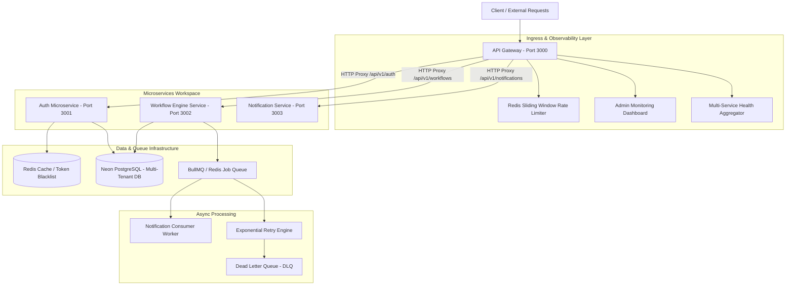

# ForgeGate - Distributed Microservices & Workflow Execution Platform

ForgeGate is an open-source, fault-tolerant, microservices-based workflow execution engine and API Gateway. Built as a high-performance pnpm monorepo in TypeScript, it delivers multi-tenant data isolation, ingress request proxying, state-machine step execution, BullMQ asynchronous queues with exponential backoff, Dead Letter Queue (DLQ) job management, structured JSON logging, and cluster observability.

---

## Architecture Overview



---

## Workspace Directory Structure

```text
ForgeGate/
├── apps/
│   ├── api-gateway/          # Central entry point, HTTP proxying, rate-limiting & admin dashboard
│   ├── auth-service/         # Authentication, multi-tenant RBAC, JWT issuance & token revocation
│   ├── workflow-service/     # Workflow state-machine engine, BullMQ retry queues & DLQ worker
│   └── notification-service/ # Asynchronous notification worker & event consumer
├── packages/
│   ├── auth/                 # Shared JWT strategies, tenant context & RolesGuard
│   ├── common/               # Shared DTOs, response transform interceptors & exception filters
│   ├── config/               # Joi validated environment schemas
│   └── logger/               # Winston structured JSON logging with trace context
├── .github/
│   └── workflows/
│       └── ci.yml            # Continuous Integration pipeline (linting, Prisma generation & build checks)
├── infra/
│   ├── docker/               # Docker Compose container orchestration
│   ├── nginx/                # Reverse proxy configuration
│   └── prometheus/           # Prometheus scraping configuration
└── prisma/                   # Centralized PostgreSQL database schema & migrations
```

---

## Key Core Capabilities

### 1. Ingress API Gateway & Active Routing
- Centralized entry point operating on port 3000.
- Reverse HTTP proxying forwarding requests to downstream microservices while preserving authentication headers, `x-tenant-id`, and request correlation context.
- Redis-backed sliding-window rate limiter enforcing request throttling (100 req/min per IP/Tenant).

### 2. Multi-Tenant Architecture & Data Isolation
- Logical tenant isolation (`Tenant` schema entity in Prisma) enforcing tenant boundary validation across database queries.
- Context propagation ensuring `tenantId` is transmitted through API Gateway proxy headers down to background BullMQ workers.

### 3. State-Machine Workflow Execution Engine
- Deterministic workflow lifecycle states: `pending` -> `running` -> `retrying` -> `completed` / `failed`.
- Pluggable action step types including `http_request` (outbound REST calls), `data_transform` (JSON payload mapping), and `email_notification`.
- Step-level execution log persistence stored transactionally in PostgreSQL.

### 4. Asynchronous Queue Processing & DLQ Replay
- Background job processing powered by BullMQ on Redis.
- Automated exponential backoff retry policy for transient step failures.
- Dead-Letter Queue (DLQ) routing for exhausted retries with REST API endpoints for manual job inspection and execution replay (`POST /api/v1/workflows/dlq/:jobId/retry`).

### 5. Multi-Tenant RBAC & Security Infrastructure
- Standardized `JwtAuthGuard` and `RolesGuard` exported from `@forgegate/auth`.
- Instant Redis token revocation blacklisting for immediate token invalidation on user logout.

### 6. System Observability & Monitoring
- Responsive dark-mode Admin Monitoring UI served directly from the gateway at `/api/v1/dashboard`.
- Prometheus metrics exporter at `/api/v1/metrics`.
- Health aggregator at `/api/v1/health` checking Redis and microservice availability.

---

## Tech Stack

| Component | Specification |
| :--- | :--- |
| **Language & Runtime** | TypeScript, Node.js v20+ |
| **Monorepo Architecture** | pnpm Workspaces |
| **Backend Framework** | NestJS v10 |
| **Database & ORM** | PostgreSQL 16 / Neon Database, Prisma ORM |
| **Caching & Queues** | Redis Cloud, BullMQ, ioredis |
| **Message Broker** | CloudAMQP RabbitMQ |
| **Logging & Metrics** | Winston (Structured JSON), Prometheus (prom-client) |
| **Containerization & CI** | Docker, Docker Compose, GitHub Actions |

---

## Getting Started

### Prerequisites
- Node.js v20.0.0 or higher
- pnpm v9.0.0 or higher
- Docker & Docker Compose (optional for local infrastructure)

### Installation & Setup

1. **Clone the Repository**:
   ```bash
   git clone https://github.com/NabarupDev/ForgeGate.git
   cd ForgeGate
   ```

2. **Install Workspace Dependencies**:
   ```bash
   pnpm install
   ```

3. **Configure Environment Variables**:
   Copy `.env.example` to `.env` and configure your database and Redis connection details:
   ```bash
   cp .env.example .env
   ```

4. **Sync Schema & Seed Multi-Tenant Data**:
   ```bash
   npx prisma db push
   pnpm run prisma:seed
   ```

5. **Build All Workspace Packages & Microservices**:
   ```bash
   pnpm run build
   ```

6. **Start All Microservices**:
   Open separate terminal windows or run each service:
   ```bash
   # API Gateway (Port 3000)
   pnpm --filter api-gateway run start:dev

   # Auth Microservice (Port 3001)
   pnpm --filter auth-service run start:dev

   # Workflow Engine (Port 3002)
   pnpm --filter workflow-service run start:dev

   # Notification Worker (Port 3003)
   pnpm --filter notification-service run start:dev
   ```

---

## Active Service Endpoints

| Endpoint | Description |
| :--- | :--- |
| `http://localhost:3000/api/v1/dashboard` | Interactive Admin Monitoring Console |
| `http://localhost:3000/api/v1/docs` | Swagger OpenAPI Documentation UI |
| `http://localhost:3000/api/v1/health` | Microservice Cluster Health Aggregator |
| `http://localhost:3000/api/v1/metrics` | Prometheus Metrics Endpoint |

---

## Contributing

Contributions are welcome. Please open an issue or submit a pull request for improvements, bug fixes, or new features.

1. Fork the repository
2. Create a feature branch (`git checkout -b feature/amazing-feature`)
3. Commit your changes (`git commit -m "feat: add amazing feature"`)
4. Push to the branch (`git push origin feature/amazing-feature`)
5. Open a Pull Request

---

## License

This project is open-source software licensed under the [MIT License](LICENSE).
