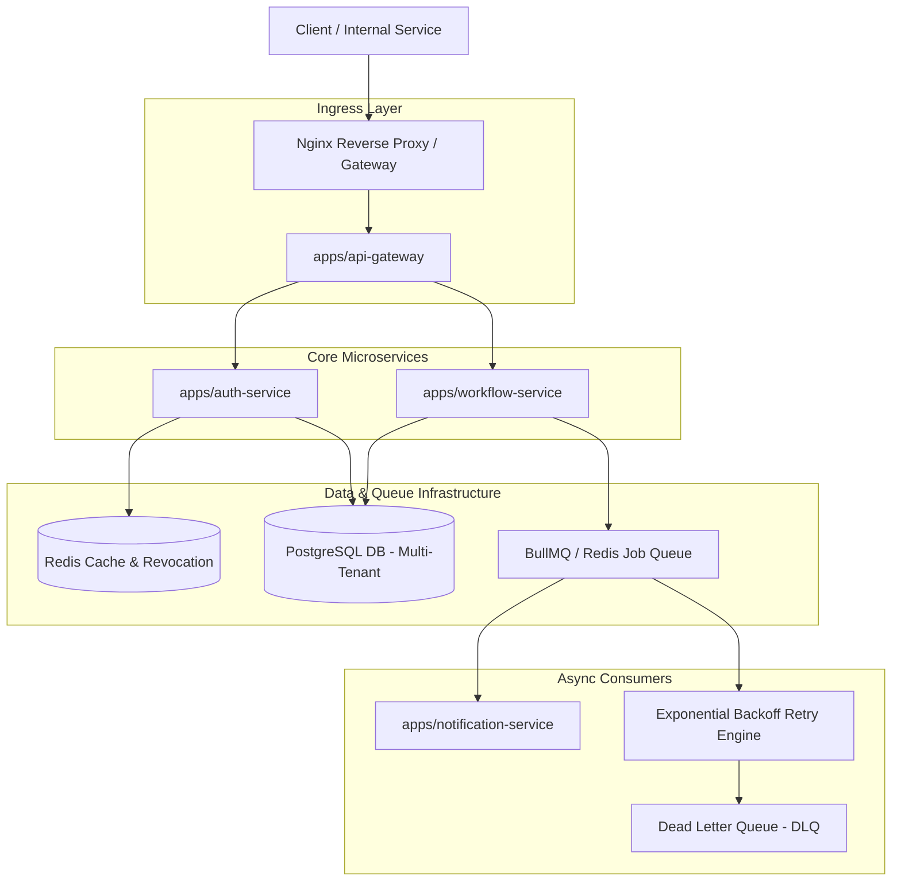

# ForgeGate -- Distributed Backend Workflow Platform

ForgeGate is a production-grade, microservices-based distributed backend workflow execution platform. Built as a high-performance pnpm monorepo, it demonstrates complex backend engineering design patterns including multi-tenancy, API Gateway routing, state-machine workflow step execution, BullMQ distributed background queues, exponential failure retries with Dead Letter Queue (DLQ) management, structured JSON logging, Redis-backed token revocation, and containerized deployment.

Instead of a basic CRUD project, ForgeGate implements core distributed systems capabilities: fault-tolerant job processing, atomic workflow step transitions, tenant data isolation, real-time observability, and active monitoring.

---

## Folder Structure

```text
ForgeGate/
├── apps/
│   ├── api-gateway/          # Central ingress entry point, swagger, metrics & admin dashboard
│   ├── auth-service/         # User authentication, multi-tenancy, JWT token revocation & RBAC
│   ├── workflow-service/     # Workflow state engine, BullMQ retry queues & DLQ worker
│   └── notification-service/ # Asynchronous email & event consumer worker
├── packages/
│   ├── common/               # Shared DTOs, response interceptors, exception filters
│   ├── logger/               # Structured JSON Winston logging module with trace correlation
│   ├── auth/                 # Shared JWT strategies, tenant context & RBAC decorators
│   └── config/               # Validated environment configuration schemas
├── infra/
│   ├── docker/               # Dockerfiles & docker-compose orchestration
│   ├── nginx/                # Reverse proxy gateway routing
│   ├── postgres/             # Database initialization
│   └── redis/                # Caching & BullMQ queue storage
├── docs/
│   ├── architecture/         # System design documentation
│   └── api/                  # OpenAPI specifications
└── prisma/                   # Centralized database schema & migrations
```

---

## High-Level Architecture



---

## Key Backend Features

- **Multi-Tenant System Design**:
  - Full data isolation across tenants (`Tenant` schema entity in Prisma).
  - Multi-tenant authentication context propagating `tenantId` across API requests and background workers.
  
- **State-Machine Workflow Execution Engine**:
  - Deterministic state transitions: `pending` -> `running` -> `retrying` -> `completed` / `failed`.
  - Configurable step execution types: `http_request` (Axios calls), `data_transform` (JSON mapping), and `email_notification`.
  - Step-by-step execution log persistence in PostgreSQL.

- **Distributed Queues, Retries & Dead Letter Queue (DLQ)**:
  - Background queue execution powered by BullMQ and Redis.
  - Automatic exponential backoff retries for transient step failures.
  - Dead Letter Queue (DLQ) routing for exhausted retries with manual/automated job replay APIs (`POST /api/v1/workflows/dlq/:jobId/retry`).

- **Real-Time Admin Monitoring Dashboard & Metrics**:
  - Built-in responsive dark-mode Admin Monitoring UI hosted at `/api/v1/dashboard`.
  - Prometheus metrics exporter endpoint (`/api/v1/metrics`) exposing `workflow_duration_seconds`, `active_jobs_total`, `failed_jobs_total`, `queue_size`, and `http_requests_total`.
  - Live DLQ inspection and cluster microservice health status.

- **Security & Token Revocation**:
  - Multi-tenant JWT authentication with access/refresh token pairs.
  - Immediate Redis token revocation blacklist upon user logout.
  - Role-Based Access Control (RBAC) with custom route guards.

- **Production Observability & Structured JSON Logging**:
  - Winston structured JSON logging (`@forgegate/logger`) with trace IDs, tenant IDs, workflow IDs, execution IDs, and duration metrics.

---

## Tech Stack

| Layer | Technology |
| :--- | :--- |
| **Language & Runtime** | TypeScript, Node.js v20+ |
| **Monorepo Manager** | pnpm Workspaces |
| **Backend Framework** | NestJS |
| **Database & ORM** | PostgreSQL 16, Prisma ORM |
| **Cache & Distributed Queue** | Redis 7, BullMQ, ioredis |
| **Reverse Proxy** | Nginx |
| **Logging & Metrics** | Winston (Structured JSON), Prometheus (prom-client) |
| **Containerization** | Docker, Docker Compose |

---

## How to Run

### Prerequisites
- Node.js v20 or higher
- pnpm (v8 or higher)
- Docker & Docker Compose

### Local Monorepo Setup

1. **Clone the Repository**:
   ```bash
   git clone https://github.com/NabarupDev/ForgeGate.git
   cd ForgeGate
   ```

2. **Install Monorepo Workspace Dependencies**:
   ```bash
   pnpm install
   pnpm approve-builds --all
   ```

3. **Configure Environment Variables**:
   ```bash
   cp .env.example .env
   ```

4. **Start Infrastructure Containers (PostgreSQL, Redis, Prometheus)**:
   ```bash
   pnpm run docker:up
   ```

5. **Generate Database Client & Seed Database**:
   ```bash
   pnpm run prisma:generate
   pnpm run prisma:seed
   ```

6. **Build All Workspace Packages & Microservices**:
   ```bash
   pnpm run build
   ```

---

## Active Endpoints

- **Admin Monitoring Dashboard**: `http://localhost:3000/api/v1/dashboard`
- **Swagger OpenAPI Documentation**: `http://localhost:3000/api/v1/docs`
- **Prometheus Metrics**: `http://localhost:3000/api/v1/metrics`
- **Gateway Health Endpoint**: `http://localhost:3000/api/v1/health`

---

## Resume Impact Highlights

When presenting ForgeGate on a backend engineering resume:

```text
ForgeGate -- Distributed Backend Workflow Platform
- Designed a multi-tenant microservices architecture with NestJS, pnpm workspaces, PostgreSQL, and Redis.
- Built a state-machine workflow engine executing multi-step HTTP/transformation tasks with status tracking.
- Implemented BullMQ distributed job queues with exponential backoff retries and Dead-Letter Queue (DLQ) replay capabilities.
- Developed an Admin Monitoring Dashboard and exposed Prometheus metrics (queue depth, execution duration, failure rates).
- Enforced multi-tenancy isolation, JWT authentication, Redis token revocation blacklisting, and structured JSON logging.
```

---

## License

MIT
