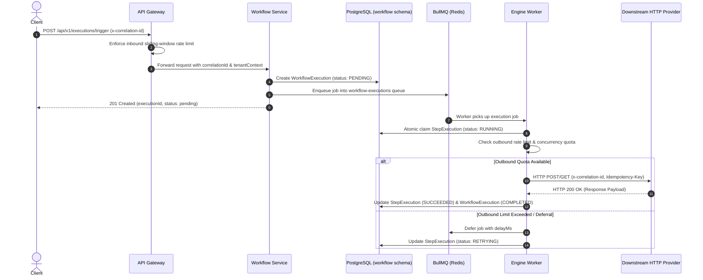
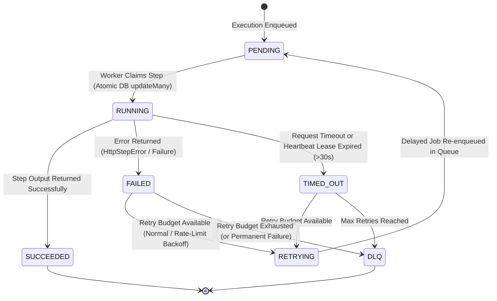
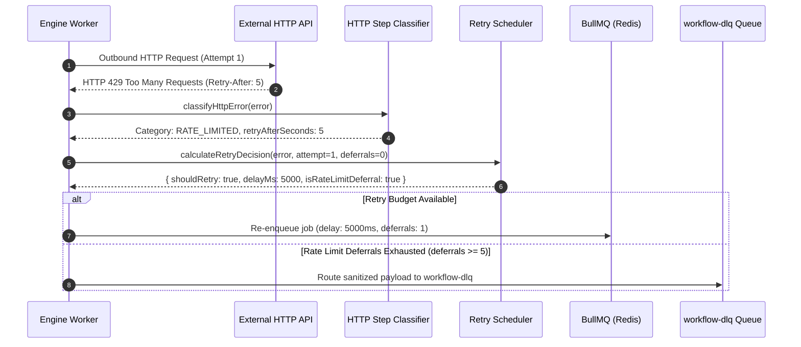

# ForgeGate Architecture & Distributed System Design

ForgeGate is an open-source distributed microservices workflow execution engine and API Gateway built as a TypeScript monorepo using NestJS, PostgreSQL (multi-schema), Redis, and BullMQ.

---

## Execution Guarantee & System Trade-offs

> [!IMPORTANT]
> **Execution Guarantee**: ForgeGate guarantees **at-least-once execution** for workflow steps, combined with configurable idempotency key propagation (`Idempotency-Key` header) for downstream HTTP providers that support deduplication.
>
> **Exactly-Once Notice**: ForgeGate does **not** claim exactly-once side-effects against arbitrary third-party HTTP endpoints due to fundamental distributed network boundaries (e.g. network partition after downstream provider execution but prior to worker acknowledgment).

---

## 1. Architecture Overview & Component Topology

```text
[ Client / External Request ]
          │
          ▼
┌────────────────────────────────────────────────────────────────────────┐
│ API Gateway (Port 3000)                                                │
│ ├─ Inbound Sliding-Window Rate Limiter (Redis)                         │
│ ├─ JWT Validation & Request Context Enrichment (x-correlation-id)     │
│ └─ Reverse Proxy Router (HTTP Proxy)                                   │
└─────────┬───────────────────────────────┬──────────────────────────────┘
          │                               │
          ▼                               ▼
┌─────────────────────────┐     ┌────────────────────────────────────────┐
│ Auth Service (3001)     │     │ Workflow Service (3002)                │
│ ├─ User Registration    │     │ ├─ Workflow & Execution REST APIs      │
│ ├─ JWT / Refresh Tokens │     │ ├─ State-Machine Orchestrator Engine   │
│ └─ Redis Revocation     │     │ └─ Outbound Rate & Concurrency Limiters│
└─────────┬───────────────┘     └─────────┬──────────────────────────────┘
          │                               │
          │                               ▼
          │                     ┌────────────────────────────────────────┐
          │                     │ Queue & Storage Layer                  │
          │                     │ ├─ BullMQ Queues (Redis)               │
          │                     │ ├─ PostgreSQL (auth/workflow schemas)  │
          │                     │ └─ Dead-Letter Queue (workflow-dlq)    │
          │                     └─────────────────┬──────────────────────┘
          │                                       │
          └───────────────────┬───────────────────┘
                              ▼
                ┌───────────────────────────┐
                │ Notification Service(3003)│
                │ └─ Worker Event Consumer  │
                └───────────────────────────┘
```

---

## 2. Service Boundaries

| Microservice | Port | Domain Responsibility | Database Schema | Primary Dependencies |
|---|---|---|---|---|
| **API Gateway** | `3000` | Ingress entrypoint, reverse HTTP proxying, correlation ID generation, inbound rate limiting, OpenAPI docs | N/A | Redis |
| **Auth Service** | `3001` | User registration, authentication strategies, multi-tenant RBAC, JWT issuance, token revocation | `auth` | PostgreSQL, Redis |
| **Workflow Service** | `3002` | Workflow definition management, execution triggering, state-machine orchestration, background workers, DLQ & replay APIs | `workflow` | PostgreSQL, Redis, BullMQ, Axios |
| **Notification Service** | `3003` | Asynchronous notification handling, email dispatches, event consumption | N/A | BullMQ / Redis |

---

## 3. Workflow Execution Lifecycle

### Execution Sequence Diagram



---

## 4. StepExecution State Machine

Each workflow step transitions deterministically through the following states:



---

## 5. Failure Classification & Retry-After Behavior

ForgeGate categorizes HTTP step failures using `classifyHttpError`:

| Failure Category | HTTP Status / Exception Code | Retryable? | Attempt Budget Consumed? | Backoff Strategy |
|---|---|---|---|---|
| `PERMANENT_FAILURE` | `400 Bad Request`, `401 Unauthorized`, `403 Forbidden`, `404 Not Found` | No | N/A | No retries. Immediate DLQ routing. |
| `RATE_LIMITED` | `429 Too Many Requests`, `503 Service Unavailable`, `529 Overload` | Yes | No (Rate limit deferral budget used) | If `Retry-After` present, exact delay parsed. Otherwise bounded exponential backoff. |
| `TRANSIENT_FAILURE` | `500 Internal Server Error`, `502 Bad Gateway`, `504 Gateway Timeout` | Yes | Yes (Normal attempt budget used) | Exponential backoff with random jitter. |
| `TIMEOUT` | `ECONNABORTED`, step execution `timeoutMs` exceeded | Yes | Yes (Normal attempt budget used) | Exponential backoff retry; step set to `TIMED_OUT`. |
| `NETWORK_FAILURE` | `ENOTFOUND` (DNS error), `ECONNREFUSED` | Yes | Yes (Normal attempt budget used) | Exponential backoff retry. |

---

## 6. Failure & Retry Sequence Diagram



---

## 7. Dead Letter Queue (DLQ) Lifecycle & Replay Engine

When a workflow step exhausts its retry attempt budget (`normalAttempts >= 3`) or rate-limit deferrals (`rateLimitDeferrals >= 5`), the execution is routed to the DLQ:

1. **Payload Redaction & Sanitization**: Sensitive authentication details (`Authorization: Bearer ***`, `api_key=***`, `password=***`) are sanitized via `sanitizePayloadString` before persistence.
2. **DLQ Diagnostics**: Captures `executionId`, `tenantId`, `workflowId`, `failedStepId`, `failureCategory`, `statusCode`, `retryCount`, `lastError`, `correlationId`, and timestamp.
3. **Manual Replay (`replayDlqJob`)**:
   - Operator triggers `POST /api/v1/workflows/dlq/:jobId/retry`.
   - Validates that the job exists in the DLQ and is not already replayed (`replayed: false`).
   - Marks the DLQ job record `replayed: true` with `replayedBy` operator ID.
   - Writes a `DLQ_REPLAY` record in `ExecutionLog`.
   - Re-enqueues the execution into `workflow-executions` with clean attempt counts.

---

## 8. Idempotency Model

For HTTP workflow steps configured with `"idempotency": { "enabled": true }`, ForgeGate constructs a stable, tenant-isolated idempotency key:

```text
forgegate:{tenantId}:{executionId}:{stepId}
```

- **Retry Stability**: The key remains identical across all retries of the same logical step execution.
- **Provider Header Forwarding**: Forwarded to third-party endpoints using `Idempotency-Key` (or configurable custom header name).
- **At-Least-Once Execution Guarantee**: If a downstream provider receives a retry request with the same idempotency key, it can safely return the cached response without repeating side-effects.

---

## 9. Inbound Rate Limiting

The API Gateway enforces inbound request throttling using a Redis sliding-window counter:
- **Default Limit**: 100 requests per minute per IP / Tenant.
- **Header Response**: Returns standard `X-RateLimit-Limit`, `X-RateLimit-Remaining`, and `X-RateLimit-Reset` headers.
- **Rejection**: Exceeded limits return HTTP 429 with retry timestamp.

---

## 10. Outbound Rate Limiting

The Workflow Engine manages outbound worker requests to external providers via `OutboundRateLimiter`:
- **Redis Token Bucket**: Coordinates outbound limits across multiple background worker processes.
- **Granular Scopes**:
  - `global`: System-wide outbound limit.
  - `provider`: Provider-wide limit (e.g. `api.openai.com`).
  - `tenant_provider`: Isolated limit per tenant per provider (e.g. `tenant-A + openai`).
  - `step`: Specific workflow step limit.
- **Non-Blocking Deferral**: If outbound quota is exceeded, the worker defers the job with backoff instead of making the HTTP request or busy-waiting.

---

## 11. Outbound Concurrency & Backpressure Controls

To prevent worker processes from flooding downstream APIs:
- **Redis Concurrency Leases**: `OutboundConcurrencyLimiter` acquires Redis-backed active lease counters.
- **Hierarchy**: Evaluates concurrency ceilings across `global`, `tenant`, `provider`, and `step` levels.
- **Backpressure Action**: If max active leases are reached, the request is rejected with `exceededScope` and the job is deferred in BullMQ.

---

## 12. Tenant Isolation & RBAC

- **Database-Level Boundaries**: All workspace database queries filter by `tenantId`.
- **JWT Context Propagation**: Gateway extracts `tenantId` from verified JWT claims and forwards it via `x-tenant-id` header to downstream services.
- **Fine-Grained Authorization (`AuthorizationPolicy`)**:
  - `admin`: Full administrative control within tenant.
  - `workflow_owner`: Create and manage owned workflows.
  - `operator`: Trigger and inspect permitted workflow executions.
  - `viewer`: Read-only access to workflows and execution logs.
- **Cross-Tenant Access Prevention**: Server-side resource ownership checks reject cross-tenant requests with `403 Forbidden` / `404 Not Found`.

---

## 13. Database Data Ownership (ADR-001)

ForgeGate enforces **Logical Service Data Ownership** using PostgreSQL multi-schema architecture (`schemas = ["auth", "workflow", "audit", "billing"]`):

```text
PostgreSQL Instance
├── Schema: auth      ── Owned by auth-service      (User, Tenant, Role, RefreshToken)
├── Schema: workflow  ── Owned by workflow-service  (Workflow, WorkflowStep, WorkflowExecution, StepExecution)
├── Schema: audit     ── Owned by Audit Subsystem   (AuditLog)
└── Schema: billing   ── Owned by Billing Subsystem (Subscription)
```

- Cross-schema Prisma `@relation` constraints have been completely removed.
- Services store loose string identifiers (`tenantId`, `createdById`, `userId`) and communicate exclusively via REST APIs or message queue events.

---

## 14. Observability & Telemetry

- **Prometheus Metrics (`/api/v1/metrics`)**: Low-cardinality counters and histograms tracking workflow executions, step execution statuses, BullMQ queue depths, outbound HTTP status distributions, and backpressure events.
- **Correlation ID Tracing (`x-correlation-id`)**:
  - Automatically generated or extracted at the API Gateway.
  - Propagated across HTTP headers, database execution metadata, BullMQ job payloads, outbound HTTP requests, and Winston structured JSON logs.
- **Structured JSON Logging**: Winston logger formats all service output in JSON, isolating high-cardinality values (`executionId`, `stepId`, `correlationId`) to log attributes to prevent Prometheus cardinality explosion.

---

## 15. Failure Recovery & Heartbeat Lease Monitoring

- **Heartbeat Lease Tracking**: Active worker processes update `StepExecution.heartbeatAt` every 10 seconds during step execution.
- **Crash Detection**: If a worker node crashes mid-execution, heartbeat updates stop.
- **Automatic Recovery**: `QueueService.recoverStaleExecutions(30000)` queries step executions with expired heartbeats (>30 seconds old), transitions old `StepExecution` records to `TIMED_OUT`, updates `WorkflowExecution` to `retrying`, and safely re-enqueues the execution into BullMQ.
